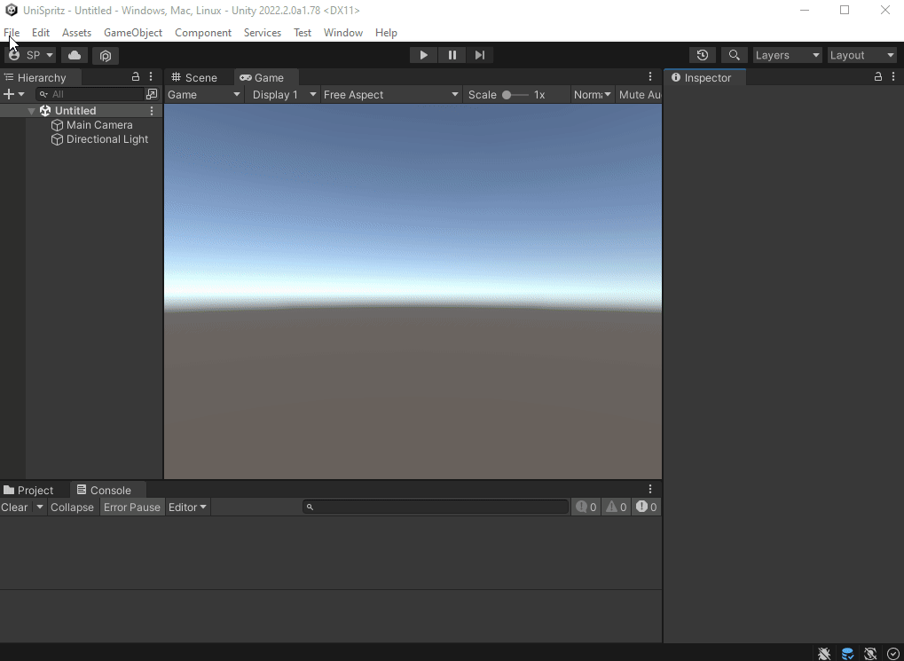

# Spritz

## What?

This is a 2D Library that can be used to create *simple* Pixel Games. The API is heavily influenced by [Pico-8](https://www.lexaloffle.com/pico-8.php).

## Why?

I like to code. I like Pixel Art games. Unity is a tremendous editor but its workflows are based on a lot of implicit systems. A few years ago I discovered [Pico-8](https://www.lexaloffle.com/pico-8.php) which is a whole development environment for a [Fantasy Console](https://en.wikipedia.org/wiki/Fantasy_video_game_console). I immedialy liked how tight and focus the Pico-8 API was. You have control over everything. And you need to code everything! That said, I am not the biggest fan of Pico-8 development environment (and of [Lua](https://www.lua.org/)). I prefer C# and Visual Studio if I need to debug complicated code. 

Hence why I created Spritz. This is a simple API to create Pixel Art games. It supports drawing pixels, sprites and basic shapes. It also supports playing sounds and that's about it! 

## What it is not?

This is not a straight port of Pico-8. There are no sprite editor, tile map editor or integrated development environment. Unity already supports this kind of tooling. There are no restriction on the game resolution, code tokens, sprite size or anything. In Fantasy Console world these arbitrary limitations help breed creativity. For myself I wanted to have a small code driven library to create any kind of pixel art games. I will chose my own restrictions :)

## Why Spritz?

Since Spritz is mainly used to make game with Sprites:

Sprites -> *Spritez* -> **Spritz**

## How?

If you want to create a new SpritzGame you can use the specifically designed Spritz Game [Scene Template](https://docs.unity3d.com/Manual/scene-templates.html):

1) Go to Menu -> New Scene (or press Ctrl + N)
2) Chose the *New Spritz Game* scene template.
3) Select a folder to save your game and give it a name. This will create a new scene and a new script (with the same name) that will allow you to start coding your game.
4) Open the script, override the functions `InitializeSpritz`, `UpdateSpritz`, `DrawSpritz` and start coding!




## Show me the code:

Here is the code of the [Hello World](projects/SpritzExamples/Assets/HelloWorld/HelloWorld.cs) example:

```csharp
using UniMini;
using UnityEngine;

public class HelloWorld : SpritzGame
{
    SpriteId m_Heart;
    AudioClipId m_Music;
    string[] text = { "H", "e", "l", "l", "o", " ", "W", "o", "r", "l", "d", "!" };
    public override void InitializeSpritz()
    {
        Spritz.CreateLayer("Spritesheets/hello_spritesheet");
        Spritz.LoadSoundbankFolder("Audio");
        m_Music = new AudioClipId("hello");
        m_Heart = new SpriteId("heart");

        Spritz.PlayMusic(m_Music, 0.5f, true);
    }

    public override void UpdateSpritz()
    {
        
    }

    // This is the same Hello World as Pico-8. Thanks Zep.
    public override void DrawSpritz()
    {
        Spritz.Clear(Color.black);
        var pal = Spritz.palette;
        for (var col = 14; col >= 7; --col)
        {
            for (var i = 0; i < text.Length; ++i)
            {
                var t1 = Time.realtimeSinceStartup * 30 + i*4 - col*2;
                var x = 8 + (i + 1) * 8 + SpritzUtil.Cosp8(t1/90) * 3;
                var y = 38 + (col - 7) + SpritzUtil.Cosp8(t1/50) * 5;
                Spritz.Print(text[i], (int)x, (int)y, pal[col]);
            }
        }

        Spritz.Print("This is Spritz", 34, 70, pal[14]);
        Spritz.Print("Keep it fresh", 34, 80, pal[12]);
        Spritz.DrawSprite(m_Heart, 60, 90);
    }
}
```

## Credits and Inspirations

This small project owns a lot of inspiration to a lot of other projects over the web:

- [Pico-8](https://www.lexaloffle.com/pico-8.php) : The original Fantasy Console. Thriving communities full of new games. I ported a lot of the builtin demos of Pico-8 as Spritz examples.
- [RetroBlit](https://assetstore.unity.com/packages/templates/systems/retroblit-102064): this incredible Unity Asset does everything Spritz does and more! It showed me that Unity can be a good host to code driven Pixel Art game development. Go and buy this package!
- [minanim.js](https://bollu.github.io/mathemagic/declarative/index.html): I ported this small library as [SpritzAnim](spritz/Runtime/SpritzAnim.cs) because I was fascinated by its brevity and clarity.
- [Oryx Design lab](https://www.oryxdesignlab.com/home) : This creator sells a lot of cool and inspirationnal sprites.
